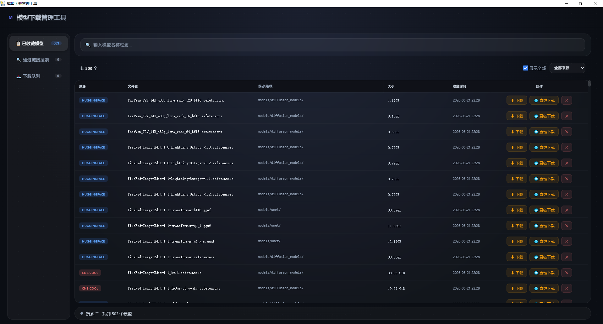
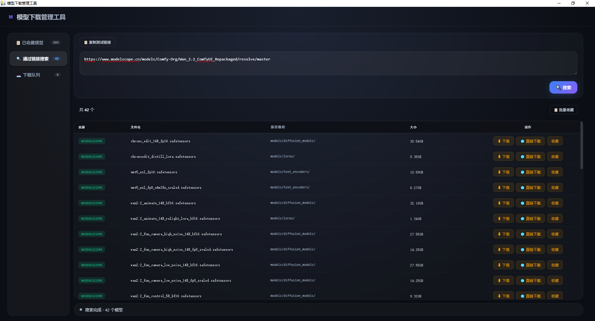
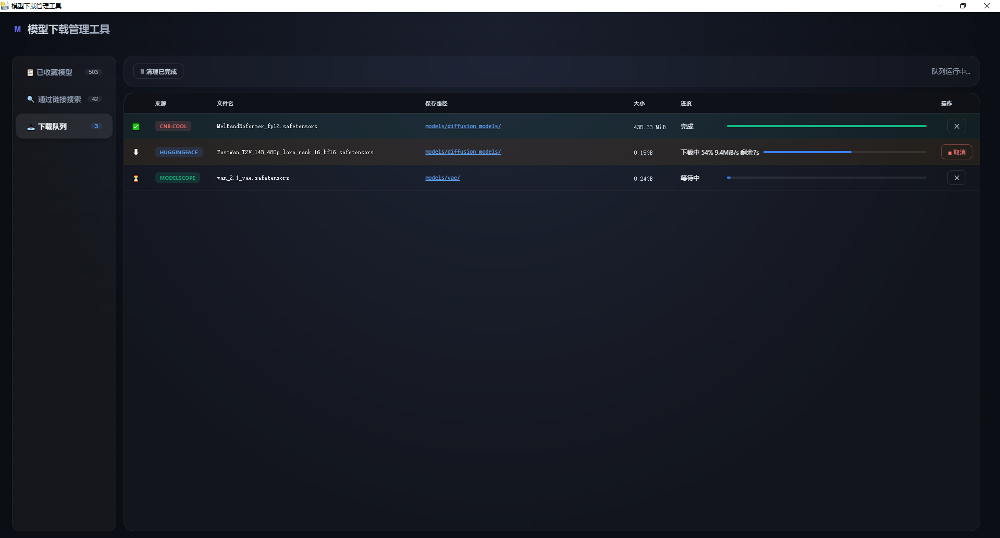

# 模型下载管理工具  已废弃  新工具为https://github.com/TianKong1992/models_downloader

支持 HuggingFace / CNB / ModelScope 三个平台的模型搜索、收藏与批量下载。

## 功能

- **已收藏模型** — 搜索、过滤来源、双击复制文件名、取消收藏、一键下载
- **通过链接搜索** — 粘贴仓库链接，实时抓取 `.safetensors` / `.gguf` 文件
- **下载队列** — 逐个下载，支持取消、30s 卡死检测、进度展示
- **HF 镜像智能切换** — 先直连 huggingface.co，不通自动走 hf-mirror.com

## 界面

### 已收藏模型
[](https://raw.githubusercontent.com/TianKong1992/ModelDownloader/refs/heads/main/static/demo1.png)

### 通过链接搜索
[](https://raw.githubusercontent.com/TianKong1992/ModelDownloader/refs/heads/main/static/demo2.png)

### 下载队列
[](https://raw.githubusercontent.com/TianKong1992/ModelDownloader/refs/heads/main/static/demo3.png)

## 运行

```powershell
# 安装依赖
pip install flask pywebview huggingface_hub requests

# 桌面版（原生窗口）
python launcher.py

# 浏览器版（开发调试）
python tool_server.py
# 打开 http://127.0.0.1:5000
```

## 打包为 exe

```powershell
# 1. 放好 aria2c.exe 到项目根目录
#    下载: https://github.com/aria2/aria2/releases

# 2. 创建虚拟环境并装依赖
python -m venv build_env
.\build_env\Scripts\activate
pip install flask pywebview huggingface_hub requests pyinstaller
deactivate

# 3. 打包
.\build.bat
```

输出 `dist\ModelDownloader.exe` 和 `dist\favorite_list.json`，发给用户即可。

## 目录结构

```
├── launcher.py            # 桌面版启动器
├── tool_server.py         # Flask 后端
├── get-model-lists.py     # 搜索引擎
├── download_models.ps1    # aria2c 下载脚本
├── aria2c.exe             # 下载引擎（需自行下载）
├── build.bat              # 打包脚本
├── favorite_list.json     # 模型数据库（外部分发）
└── static/                # 前端文件
```

## 依赖

| 包 | 用途 |
|---|---|
| flask | Web 后端 |
| pywebview | 桌面窗口 |
| huggingface_hub | HF 仓库搜索 |
| requests | HTTP 请求 |
| pyinstaller | 打包 exe（仅开发时需要） |
| aria2c.exe | 下载引擎（运行时需要） |
